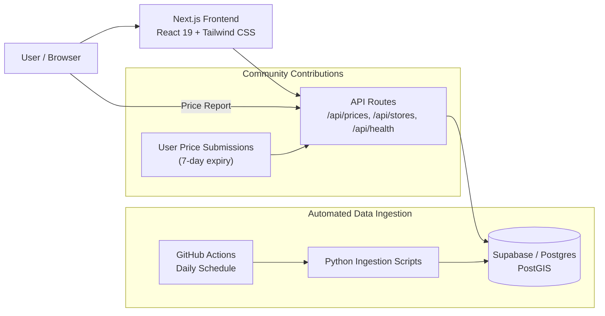

# Monster Cork

Find the cheapest Monster Energy drinks near you in Cork, Ireland.

**Monster Cork** is a location-aware price comparison app that tracks energy drink prices across Irish retailers. Users can search by area, find nearby stores with the best deals, and contribute prices back to the community — all on a map-driven interface.

**[View Live Demo](https://white-monster-tracker.vercel.app)**

---

## Features

- **Location-based search** — uses device geolocation or manual area entry to find nearby prices within a configurable radius
- **Live price comparisons** — prices across Tesco, Dunnes, SuperValu, Lidl, Aldi, Centra, and other retailers, updated daily
- **Filter by variant & pack size** — Zero Sugar, Ultra White, Ultra Rosa, Ultra Paradise; single cans and 4-packs
- **Interactive map** — Leaflet-based store locator with distance markers and price popups
- **Community price reporting** — users can submit prices they spot in stores; submissions expire after 7 days
- **Data freshness monitoring** — health endpoint tracks staleness and prevents Supabase free-tier pausing via scheduled pings

---

## Architecture



The frontend is a Next.js App Router single-page application. API routes query Postgres with PostGIS extensions for geospatial radius filtering. Price data flows from two sources: automated ingestion jobs run daily via GitHub Actions, and community-reported prices submitted through the app.

---

## Tech Stack

| Layer | Technology |
|---|---|
| Framework | Next.js 16 (App Router) |
| UI | React 19, TypeScript (strict) |
| Styling | Tailwind CSS v4, shadcn/ui v4 |
| Animation | framer-motion |
| Database | Supabase (Postgres + PostGIS) |
| Maps | Leaflet, react-leaflet |
| Testing | Vitest, jsdom |
| Package Manager | Bun |
| Data Ingestion | Python 3.11 |
| CI/CD | GitHub Actions, Vercel |

---

## How It Works

1. **Centralized pricing** — each retailer has a national price entry stored in the database. The API expands these to physical store locations at query time.
2. **Spatial search** — users provide their location (browser geolocation or manual input). The API returns stores within a configurable radius, sorted by distance or price.
3. **Automated collection** — Python scripts run daily via GitHub Actions, fetching current prices from retailer platforms and upserting them into the database.
4. **Community contributions** — users can report prices they see in stores. Submitted prices are stored separately with a 7-day expiry and merged into query results alongside automated data.
5. **Freshness tracking** — every price record carries a timestamp. The health endpoint classifies data as fresh, stale, or outdated, and a Vercel cron job prevents the free-tier database from pausing.

---

## Local Development

### Prerequisites

- Node.js 18+
- [Bun](https://bun.sh) (v1.2+)
- A Supabase project (free tier works)

### Setup

```bash
bun install
```

Copy `.env.example` to `.env.local` and configure your Supabase project credentials:

```env
NEXT_PUBLIC_SUPABASE_URL=https://your-project.supabase.co
NEXT_PUBLIC_SUPABASE_ANON_KEY=your-anon-key
```

Start the development server:

```bash
bun dev
```

Open [http://localhost:3000](http://localhost:3000).

### Commands

| Command | Description |
|---|---|
| `bun dev` | Development server with hot reload |
| `bun run build` | Production build |
| `bun run lint` | ESLint |
| `bun test` | Run tests (Vitest) |
| `bun test:watch` | Tests in watch mode |

---

## Environment Variables

| Variable | Required | Purpose |
|---|---|---|
| `NEXT_PUBLIC_SUPABASE_URL` | Yes | Supabase project URL |
| `NEXT_PUBLIC_SUPABASE_ANON_KEY` | Yes | Public anon key (safe for client) |
| `SUPABASE_URL` | Ingestion only | Supabase URL for ingestion scripts |
| `SUPABASE_SERVICE_KEY` | Ingestion only | Service-role key (server-side only) |
| `FIRECRAWL_API_KEY` | Optional | AI-powered scraping provider |

**Security note:** Service-role credentials must never be exposed to the client. The web app uses only the anon key with Row Level Security policies. Ingestion scripts run server-side in GitHub Actions with restricted secrets.

---

## Data Ingestion

Price data is collected through automated Python scripts that run daily via GitHub Actions. The ingestion pipeline is designed for reliability: each retailer runs independently, failures are non-fatal, and logs are captured as artifacts for debugging.

Ingestion scripts are located in `scripts/scrapers/` and extend a common `BaseScraper` class that enforces rate-limiting, retry logic with exponential backoff, and output validation.

---

## Project Structure

```
monster-cork/
├── app/                      # Next.js App Router
│   ├── page.tsx              # Main dashboard
│   ├── layout.tsx            # Root layout
│   ├── globals.css           # Tailwind v4 theme tokens
│   └── api/                  # Route handlers (prices, stores, health)
├── components/
│   ├── ui/                   # shadcn/ui primitives
│   ├── dashboard/            # Price list, filters, map, forms
│   ├── shared/               # Header, Footer
│   └── map/                  # Leaflet wrapper (dynamic import)
├── hooks/                    # use-geolocation
├── lib/
│   ├── types.ts              # Store, Product, Price interfaces
│   ├── constants.ts          # Retailer definitions, variants, radius limits
│   ├── geo.ts                # Distance utilities (geolib)
│   └── supabase/             # Server + browser clients
├── scripts/scrapers/         # Python data ingestion (runs in CI)
├── supabase/migrations/      # SQL schema migrations
└── .github/workflows/        # CI/CD workflows
```

---

## Roadmap

- Additional retailer coverage
- Price history and trend charts
- Email/notification alerts for price drops
- Expanded geographic coverage beyond Cork
- Mobile app wrapper

---

## Disclaimer

Monster Cork is an independent, educational project. It is not affiliated with Monster Energy Corporation or any of the retailers listed. Product names, logos, and brands are the property of their respective owners. Prices are provided for informational purposes and may not reflect current in-store pricing. If you are a retailer and wish to have your data excluded, please open an issue.
